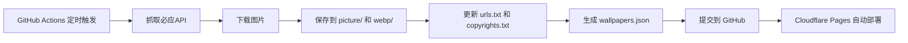

<div align="center">

# 🌅 Bing Wallpaper

### 每日必应壁纸 · 自动抓取 · 优雅展示

[](https://github.com/chnbsdan/bing-img/actions)
[](https://github.com/chnbsdan/bing-img/commits)
[](https://github.com/chnbsdan/bing-img)
[](https://sfx.de5.net)
[](LICENSE)

</div>

<p align="center">
  
</p>

---

## ✨ 特性

- 📸 **每日自动抓取** - GitHub Actions 定时运行，每天自动获取最新必应壁纸
- 🖼️ **优雅的瀑布流展示** - 7列网格布局，悬停显示版权信息
- 🔍 **强大的搜索功能** - 支持按日期、标题、版权信息搜索
- 📄 **智能分页** - 每页42张，支持页码跳转
- 🎨 **全屏预览** - 点击图片大图预览，支持缩放拖拽
- 💾 **本地缓存60天** - 近60天图片存储在仓库，历史图片使用CDN链接
- 📱 **完全响应式** - 适配桌面、平板、手机
- ⚡ **Cloudflare Pages** - 全球CDN加速，访问飞速

---

## 🚀 在线演示

| 环境 | 地址 |
|------|------|
| 🌍 生产环境 | [https://sfx.de5.net](https://sfx.de5.net) |
| 📷 API 文档 | [https://sfx.de5.net/api](https://sfx.de5.net/api) |
| 🖼️ 随机壁纸 | [https://sfx.de5.net/api/random](https://sfx.de5.net/api/random) |
| 📅 今日壁纸 | [https://sfx.de5.net/api/daily](https://sfx.de5.net/api/daily) |

---

## 📦 项目结构

```
bing-img/
├── .github/
│   └── workflows/
│       └── update.yml          # GitHub Actions 定时任务
├── functions/
│   └── api/
│       ├── daily.js            # 每日壁纸 API
│       ├── index.js            # API 文档
│       └── random.js           # 随机壁纸 API
├── scripts/
│   └── fetch.js                # 壁纸抓取脚本
├── data/
│   └── wallpapers.json         # 壁纸元数据（完整）
├── picture/                    # 原图缓存（60天）
├── webp/                       # WebP 缓存（60天）
├── urls.txt                    # 图片链接列表
├── copyrights.txt              # 版权信息列表
├── index.html                  # 首页
└── package.json                # 项目配置
```

---

## 🛠️ 技术栈

| 类别 | 技术 |
|------|------|
| **前端** | HTML5 + CSS3 + Vanilla JavaScript |
| **图标** | Font Awesome 6 |
| **后端** | Cloudflare Pages Functions |
| **自动化** | GitHub Actions |
| **图片处理** | Sharp (Node.js) |
| **CDN** | Cloudflare Pages |
| **版本控制** | Git + GitHub |

---

## 📖 使用指南

### 本地运行

```bash
# 克隆项目
git clone https://github.com/chnbsdan/bing-img.git
cd bing-img

# 安装依赖
npm install

# 手动抓取壁纸
npm run fetch

# 启动本地服务
npx serve .
```

### 环境变量

| 变量 | 说明 | 默认值 |
|------|------|--------|
| `KEEP_DAYS` | 本地图片保留天数 | `60` |
| `PAGE_SIZE` | 每页显示数量 | `42` |

### API 接口

| 接口 | 方法 | 说明 |
|------|------|------|
| `/api/random` | GET | 随机返回一张壁纸 |
| `/api/random?redirect=true` | GET | 302 重定向到随机壁纸 |
| `/api/daily` | GET | 返回今日壁纸 (WebP) |
| `/api/daily?format=jpeg` | GET | 返回今日壁纸 (JPEG) |
| `/api/daily?redirect=true` | GET | 302 重定向到今日壁纸 |
| `/api` | GET | API 文档页面 |

---

## 🤖 自动更新机制



**定时任务：**
- 每天 UTC 1:00（北京时间 9:00）
- 每天 UTC 9:00（北京时间 17:00）

---

## 📊 数据统计

| 指标 | 数值 |
|------|------|
| 📸 壁纸总数 | 1,529+ (每日递增) |
| 💾 本地图片 | 60 天 |
| 📄 每页数量 | 42 张 |
| 🌐 支持地区 | 全球 CDN |

---

## 🎯 路线图

- [x] 每日自动抓取
- [x] 7列网格展示
- [x] 搜索功能
- [x] 分页控制
- [x] 全屏预览
- [x] Cloudflare Pages 部署
- [x] API 接口
- [ ] 暗色/亮色主题切换
- [ ] 用户收藏功能
- [ ] 壁纸下载统计

---

## 🤝 贡献

欢迎提交 Issue 和 Pull Request！

1. Fork 本仓库
2. 创建你的分支 (`git checkout -b feature/AmazingFeature`)
3. 提交你的修改 (`git commit -m 'Add some AmazingFeature'`)
4. 推送到分支 (`git push origin feature/AmazingFeature`)
5. 打开 Pull Request

---

## 📄 许可证

MIT License © 2026 chnbsdan

---

<div align="center">

**⭐ 如果这个项目对你有帮助，请给个 Star！**

[⬆ 回到顶部](#-bing-wallpaper)

</div>
